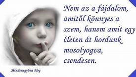

#### **ABORTUSZ, MAGZATVESZTÉS - lelki fájdalmak gyógyulása**

### _„Ne félj, nem ítéllek el!”_ hétvége

#### 

##### **Abortusz, vetélés, a gyermek halva születése**, … mind olyan mély seb, ami akadályozhatja, hogy derűs, kiegyensúlyozott életet élj. Lehet, hogy friss, lehet, hogy már régen történt, de elő - előtör és nem találod a lelki békédet.

##### Tapasztalod a következményeit önértékelési válság, bűntudat, harag, kapcsolati nehézségek, depresszió…

##### Egy ideig el lehet némítani a szív hangját, ez akár évtizedekig is eltarthat, de valamilyen krízis az életedben előhozza az elfeledettnek gondolt traumát.

##### **Ne cipeld tovább ezt a terhet!**

##### Az elmúlt évtized alatt sokak élete megváltozott ezeken a sorstársak körében eltöltött hétvégéken.

##### **Hétvégénk lelki ajándékai**

##### A lelkigyakorlat végén megkérdeztük a résztvevőket, mi változott meg a szívükben a három nap alatt?

##### Hölgyek, férfiak őszintén válaszoltak. Egy 19 éves fiatal résztvevőnk hegedült. (3 perc 54 mp)

##### Meghallgathatók a hétvége lelki ajándékai:

<audio src="hetvege_ajandeka.mp3" controls="controls">
Your browser does not support the audio element.
</audio>

##### Segítő testvéreinkkel együtt Téged is szeretettel várunk:

##### Mária & Ferenc